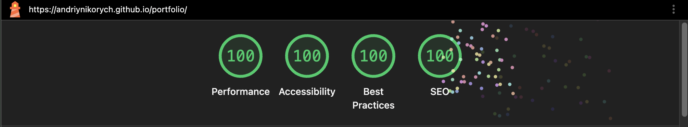
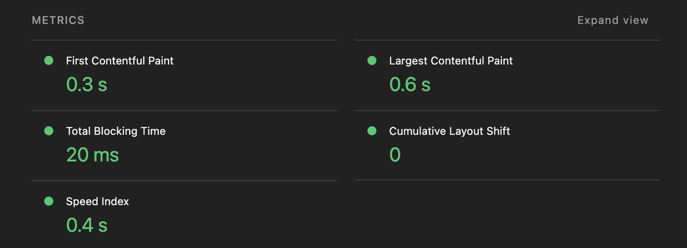

# Andrii Nikorych — Portfolio

[🌐 Open Website](https://andriynikorych.github.io/portfolio/en/)

Interactive portfolio built as a macOS-inspired web experience with theme switching, multilingual support, and rich animations.

---

## ✨ Features

### 🌗 Theme Switching
- **Light / Dark mode** powered by [next-themes](https://github.com/pacocoursey/next-themes)
- Detects system preference automatically (`enableSystem`)
- Interactive lamp switcher on the home page to toggle the theme
- Theme selector with visual previews inside Settings

### 🌍 Internationalization (i18n)
- **English** and **Ukrainian** languages
- Custom lightweight i18n store built with `useSyncExternalStore` — no heavy libraries
- Messages loaded on demand with in-memory caching
- Language persisted in `localStorage`

### 🎬 Animations (GSAP)
- Powered by [GSAP](https://gsap.com/) with the **TextPlugin**
- Typewriter text effect on the home page
- Smooth timeline-based transitions between pages (zoom into MacBook screen)
- Animated open/close for Explorer windows and Contacts panel (scale, translate, opacity)
- macOS-style loading bar animation
- Letter-opening animation with 3D rotation on the Valentine page

### 🏆 Lighthouse — 100 / 100 / 100 / 100

| Metric | Value |
|---|---|
| **First Contentful Paint** | 0.3 s |
| **Largest Contentful Paint** | 0.6 s |
| **Total Blocking Time** | 20 ms |
| **Cumulative Layout Shift** | 0 |
| **Speed Index** | 0.4 s |

> The site is statically generated at build time (SSG) using Next.js `output: "export"` with React Server Components, which ensures instant page loads with zero server runtime overhead.

---

## 🛠 Tech Stack

| Category | Technology                                                                                     |
|---|------------------------------------------------------------------------------------------------|
| **Framework** | [Next.js 16](https://nextjs.org/) (App Router, Static Export)                                  |
| **Rendering** | Static Site Generation (SSG) + React Server Components                                         |
| **Runtime** | [Node.js](https://nodejs.org/)                                                                 |
| **Language** | React.js, TypeScript                                                                           |
| **UI** | React 19, SCSS Modules, CSS Variables                                                          |
| **Theming** | [next-themes](https://github.com/pacocoursey/next-themes)                                      |
| **i18n** | Custom store (`useSyncExternalStore` + JSON locale files)                                      |
| **Animations** | [GSAP 3](https://gsap.com/) + TextPlugin                                                       |
| **Icons** | [Lucide React](https://lucide.dev/), inline SVGs via `@svgr/webpack`                           |
| **UI Components** | [MUI X Date Pickers](https://mui.com/x/react-date-pickers/), Liquid Glass effect (SVG filters) |
| **Forms** | [React Hook Form](https://react-hook-form.com/)                                                |
| **Data Fetching** | [SWR](https://swr.vercel.app/)                                                                 |
| **Styling** | SASS / SCSS Modules, [classnames](https://github.com/JedWatson/classnames)                     |
| **Linting / Formatting** | ESLint, Prettier                                                                               |
